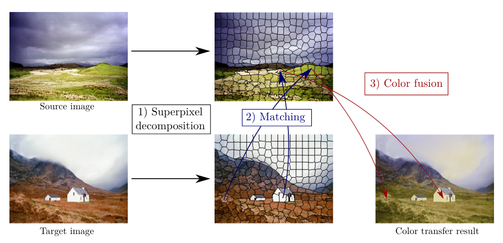
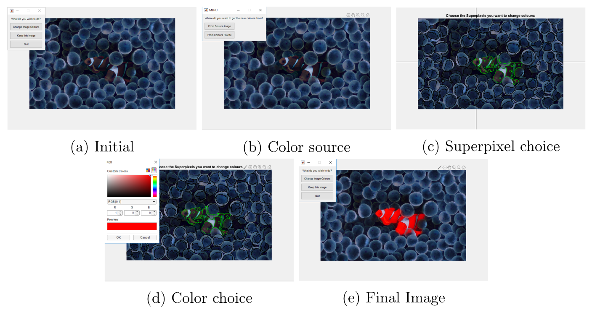

# SuperPixel Based Video Color Transfer

### Overview
Project oriented by Rémi Giraud at ENSIRB-MATMECA:  
Re-Implementation of paper with an extension to the fusion in videos and an user interface to manually change the colors:
```
@article{SP_ColourTransfer,
    author = "Rémi Giraud, Vinh-Thong Ta, Nicolas Papadakis",
    title = "Superpixel-based Color Transfer. IEEE International",
    journal = "Conference on Image Processing (ICIP)",
    year = "Sep 2017, Beijing, China",
}
```



Example of the utilization of the interface:



### Requirements

- Linux or Windows

- MATLAB Version R2018b or newer


### Execution

- Download or clone the repository

#### MATLAB / C-Mex

To make things easier there's already a built MEX for Ubuntu 18.04 and Windows 10 in ./code/MEX/.
- If the MEX do not work for you, make sure you have a C/C++ compiler and run

```
run SETUP.m    %build the MEX for the SO;
```

```
run main.m    %Asks for 2 input images and performs;
```


### License and Contact

Student: Rodrigo Borba Pinheiro,  2019  
rodrigo.borba_pinheiro@bordeaux-inp.fr  
ENSEIRB-MATMECA (Bordeaux INP), Electronic Engineering - Signal and Image Processing  

(C) Rémi Giraud, 2020  
remi.giraud@u-bordeaux.fr  
[https://rgiraud.vvv.enseirb-matmeca.fr](https://rgiraud.vvv.enseirb-matmeca.fr)  
ENSEIRB-MATMECA (Bordeaux INP), Laboratory IMS

This code is free to use, share and modify for any non-commercial purposes.  
Any commercial use is strictly prohibited without the authors' consent.
