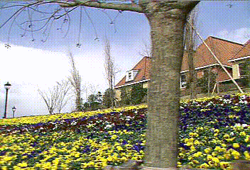
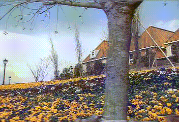

# SuperPixel Based Color Transfer + Interface and Video

### Overview

#### Source Image


#### Video Target



#### Video Result



### Requirements

- Linux or Windows

- MATLAB Version R2018b or newer


### Execution

- Download or clone the repository

#### MATLAB / C-Mex

To make things easier there's already a built MEX for Ubuntu 18.04 and Windows 10 in ./code/MEX/.
- If the MEX do not work for you, make sure you have a C/C++ compiler and run

```
run SETUP.m    %build the MEX for the SO;
```

```
run main.m     %runs the transfer for the files specified in the script
```

Note: The code takes a very long time to run!
