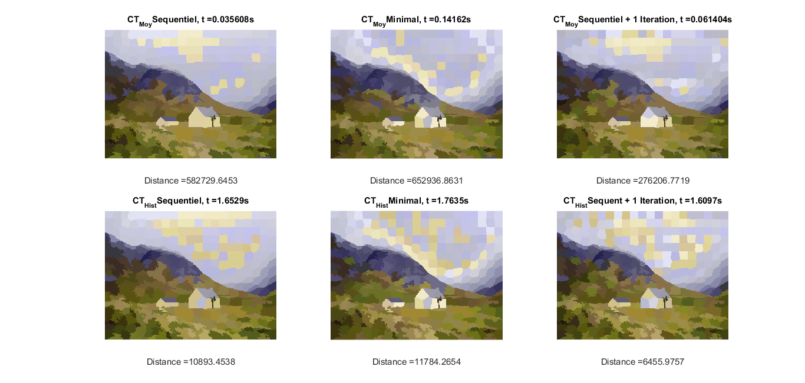

# Comparison of distance using different methods

### Overview
Compare different methods of color matching between the source and target images, both using histogram distance and mean color:

Note: You cannot compare the distances between mean and histogram (they are not calculated the same way).

#### Sequential

We go through the pre calculated superpixels of the target image and we choose the superpixel from the source image which the distance is the minimum. Really fast, not optimal. We only goes through the image once. However, we can only choose the superpixel from the source image once.

#### Minimal

We calculate the distance between all the superpixels in the target image to all the superpixels in the source image and associate them, always choosing the lower value. Global distance is not optimal and is slower than the sequential method.

#### Iterative

We use the sequential method and then we go through the image again. In the second go-through we can change some of the matches to reduce the global distance of the images.




### Requirements

- Linux or Windows

- MATLAB Version R2018b or newer


### Execution

- Download or clone the repository

#### MATLAB / C-Mex

To make things easier there's already a built MEX for Ubuntu 18.04 and Windows 10.
- If the MEX do not work for you, make sure you have a C/C++ compiler and run

```
run SETUP.m    %build the MEX for the SO;
```

```
run main.m     %Displays the image with all the 6 options;
```

### Use

If you see better results in one of the methods, you can modify the main code to use the chosen method.
Just copy and paste the corresponding code to the main /code folder and change it in the main.m
