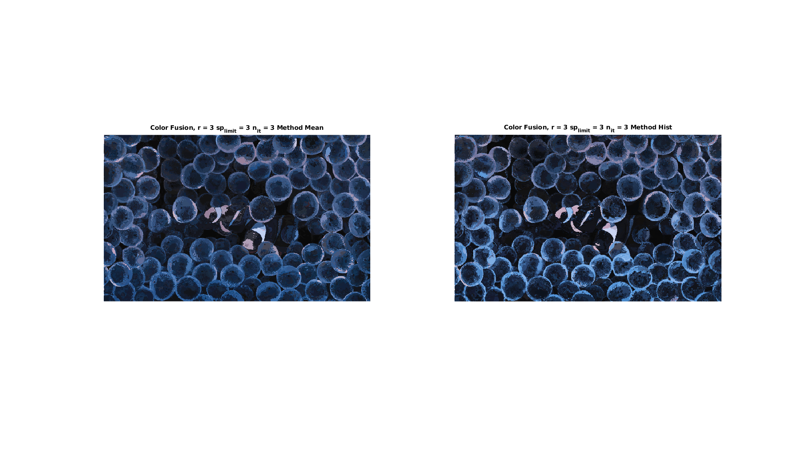

# Comparison of transfer using mean or histogram




### Requirements

- Linux or Windows

- MATLAB Version r2018 or newer


### Execution

- Download or clone the repository

#### MATLAB / C-Mex

To make things easier there's already a built MEX for Ubuntu 18.04 and Windows 10.
- If the MEX do not work for you, make sure you have a C/C++ compiler and run

```
run SETUP.m    %build the MEX for the SO;
```

```
run main.m     %Displays the image with all the 6 options;
```

### Use

Just a comparison between the results with the mean transfer and the histogram transfer.
The script takes a long time to run, not that useful, unless you want to see the visual comparison.
